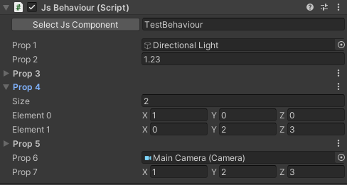

# Unity+[Puerts](https://github.com/Tencent/puerts)实现的JsBehaviour

* 为什么要实现这个JsBehaviour？  
主要是想通过JsBehaviour实现对GameObject和组件的引用以及提供可编辑的参数，实现资源和代码更好的解耦。  
* 使用方式如下  
1. 在Ts中如下定义Js组件：
```js
/**
 * 使用component修饰器定义TestBehaviour为Js组件
 */
@component()
class TestBehaviour extends Component {
    /**
     * 使用property修饰器定义需要在Inspector上显示的属性及其类型
     */
    @property(UnityEngine.GameObject)
    prop1: UnityEngine.GameObject;

    /**
     * 数组的几种定义形式
     */
    @property({
        type: UnityEngine.GameObject,
        isArray: true
    })
    prop3: UnityEngine.GameObject[];
    @property([UnityEngine.Vector3])
    prop4: UnityEngine.Vector3[];
    @property({
        type: [System.UInt32]
    })
    prop5: System.UInt32[];

    /**
     * editable未实现，仅演示功能扩展模式
     */
    @property({
        type: System.Single,
        editable: true
    })
    prop2: System.Single;
}
```
2. 在GameObject中添加JsBehaviour组件，在JsBehaviour组件中选择Js组件，JsBehaviour会列出对应Js组件的属性。  



* 该JsBehaviour实现未做完整测试，也未完整实现所有可能的属性展示需求，仅提供一种实现思路，实际使用需要根据需求扩展维护，欢迎ISSUES和PR。